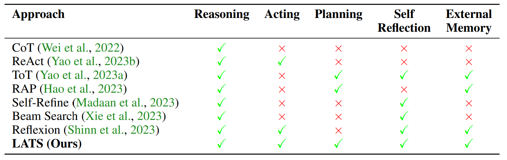

# Ideas:
1. Adopt a persona (multiple existing approaches also use that)
2. Ask to write a fix (Noever found it helpful)
3. Self-reflection/criticize and improve
4. Ask to write a test
5. Ask to first try and understand the code, secondly write a code with the same goal, thirdly compare and see if the provided code has vulnerabilities.
6. Use agents to query information about the CWE from internet and then make final decision (or alternatively put together a dict with every vulnerability, the description and example?)
7. Hints? Not sure how to utilize that
8. Dataflow analysis (Khare and Dutta)
9. Provide API / dataflow descriptions

# Potential clues:
1. Output of SCAT tools
2. AST representation (extracting DFG aor API call descriptions would require extra work)
3. ? Running the outputted code in virtual environment (probably not trivial)
4. Potentially could put the code together with AST...

# Agents considerations:
1. Potentially give agent access to AST, SCAT results, previous LLM results and ask to make a judgement (can query, but can also not)
2. 

# Strategies:
1. Simple/basic prompt: Use role base prompting, but with no other clues
2. Simple/basic prompt with self refinement: 
   Use prompt from 1. and ask it to improve results using ideas from here: https://arxiv.org/pdf/2303.17651.pdf
3. Simple/basic prompt with RCI: 
   Use prompt from 1. and ask it to improve results using ideas from here: https://arxiv.org/pdf/2303.17491.pdf
4. Simple/basic prompt with simple self refinement: 
   Similar to 2. but less elaborate and simpler approach.
5. Noever prompt
6. Noever prompt with RCI/self-reflection/self-refinement (based on which one worked the best with simple prompts)
7. Dataflow analysis prompt
8. Dataflow analysis prompt with RCI/self-reflection/self-refinement (based on which one worked the best with simple prompts)
9. Noever prompt + test (karl_prompt)
10. Noever prompt + test with RCI/self-reflection/self-refinement (based on which one worked the best with simple prompts)
11. 

# Complex strategy considerations:
1. CoT (Chain of Thought): Is good for solving problems step-by-step. 
   Can it be utilized here? Asking first to explain the code and then provide response has not shown improvements for similar tasks: https://arxiv.org/pdf/2308.12697.pdf
2. ToT (Tree of Thought): Similar problem to previous one.
3. ReAct (Reason + Act): Potentially guess a vulnerability and then search internet for examples to use some type of few-shot approach?
4. RAP (Reasoning via planning): 

Image from: https://arxiv.org/pdf/2310.04406v2.pdf